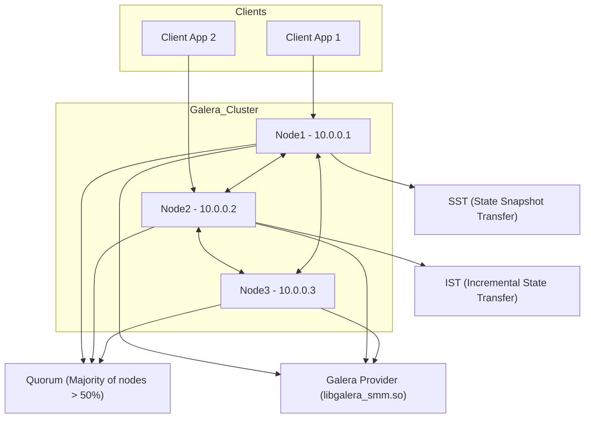

# Galera MariaDB Cluster (3 Node Setup)

Bu proje, **3 düğümlü (node)** bir Galera Cluster kurulumu gerçekleştirmek isteyen sistem yöneticileri ve geliştiriciler için hazırlanmıştır. MariaDB veritabanı, Galera ile senkronize çalışarak yüksek erişilebilirlik (HA) ve veri tutarlılığı sağlar.

---

## 🧩 Mimaride Kullanılan Bileşenler

- **Galera**: Synchronous Multi-Master Replication.
- **MariaDB 10.6.x**: MySQL uyumlu, gelişmiş açık kaynaklı veritabanı.
- **rsync**: SST (State Snapshot Transfer) için tercih edilen yöntem.
- **Ubuntu 22.04 LTS**: Tüm node’lar için önerilen işletim sistemi.

---

## 🌐 Cluster Yapılandırması

| Node  | IP Adresi   | Hostname |
|-------|-------------|----------|
| Node1 | 10.0.0.1    | node1    |
| Node2 | 10.0.0.2    | node2    |
| Node3 | 10.0.0.3    | node3    |

---

## 📊 Galera Cluster Mimarisi



---

## ⚙️ Örnek `my.cnf` Yapılandırması

(Detaylı yapılandırmalar her node için `node1/my.cnf`, `node2/my.cnf`, `node3/my.cnf` klasörlerinde yer alır.)

```ini
[mysqld]
binlog_format=ROW
default-storage-engine=innodb
innodb_autoinc_lock_mode=2
bind-address=0.0.0.0

# Galera Provider Configuration
wsrep_on=ON
wsrep_provider=/usr/lib/galera/libgalera_smm.so

# Galera Cluster Configuration
wsrep_cluster_name="galera_cluster"
wsrep_cluster_address="gcomm://10.0.0.1,10.0.0.2,10.0.0.3"

# Galera Synchronization Configuration
wsrep_sst_method=rsync

wsrep_node_name="nodeX"          # Node ismine göre değiştir
wsrep_node_address="10.0.0.X"    # Node IP adresine göre değiştir
```

---

## 🔧 Kurulum Adımları

1. **MariaDB ve Galera kurulumu:**

```bash
sudo apt update
sudo apt install mariadb-server galera-4 rsync -y
```

2. **Yapılandırma dosyasını düzenleyin** (Her node için kendi IP ve node adı ile).

3. **Firewall Ayarları (Tüm Node'larda):**

```bash
sudo ufw allow 3306/tcp      # MariaDB portu
sudo ufw allow 4567/tcp      # Galera Cluster replication portu
sudo ufw allow 4568/tcp      # Incremental State Transfer (IST) portu
sudo ufw allow 4444/tcp      # State Snapshot Transfer (SST) portu
sudo ufw enable
```

4. **İlk Node'da Cluster başlatın:**

```bash
sudo galera_new_cluster
```

5. **Diğer Node'ları başlatın:**

```bash
sudo systemctl start mariadb
```

---

## 🩺 Cluster Durumunu Kontrol Etme

```bash
mysql -u root -p -e "SHOW STATUS LIKE 'wsrep_cluster_size';"
```

- Eğer **wsrep_cluster_size** değeri 3 ise, tüm node'lar birbirine başarılı şekilde bağlanmış ve senkronizedir.
- 1 veya farklı bir sayı görüyorsanız, cluster tam oluşmamıştır.

---

## 💾 Veri Ekleme ve Test Etme

Herhangi bir node üzerinden aşağıdaki komutları kullanarak cluster üzerinde veri ekleyip senkronizasyonu test edebilirsiniz.

1. **MariaDB’ye bağlanın:**

```bash
mysql -u root -p
```

2. **Test için yeni bir veritabanı oluşturun:**

```sql
CREATE DATABASE testdb;
USE testdb;
CREATE TABLE users (
    id INT AUTO_INCREMENT PRIMARY KEY,
    name VARCHAR(100) NOT NULL
);
```

3. **Bir kayıt ekleyin:**

```sql
INSERT INTO users (name) VALUES ('Galera User 1');
```

4. **Diğer node’lardan veriyi kontrol edin:**

Diğer node’larda `mysql -u root -p testdb` ile bağlanıp:

```sql
SELECT * FROM users;
```

- Eklediğiniz kayıtların diğer node’larda da görünmesi gerekir.
- Eğer görünmüyorsa, cluster bağlantısı veya senkronizasyon ile ilgili sorun vardır.

---

## ⚠️ Olası Sorunlar ve Çözümler

- **wsrep_cluster_size 1 olarak görünüyorsa:**
  - Firewall ayarlarını kontrol edin.
  - IP adresleri ve `wsrep_cluster_address` yapılandırmasının doğru olduğundan emin olun.
  - Node’ların birbirlerine ping atabildiğinden emin olun.
  - `galera_new_cluster` komutunun ilk node’da çalıştırıldığından emin olun.

- **MariaDB servisi başlamıyor:**
  - `journalctl -xe` veya `systemctl status mariadb` ile hata detaylarını inceleyin.
  - Yapılandırma dosyasındaki yazım ve IP adresi hatalarını düzeltin.

