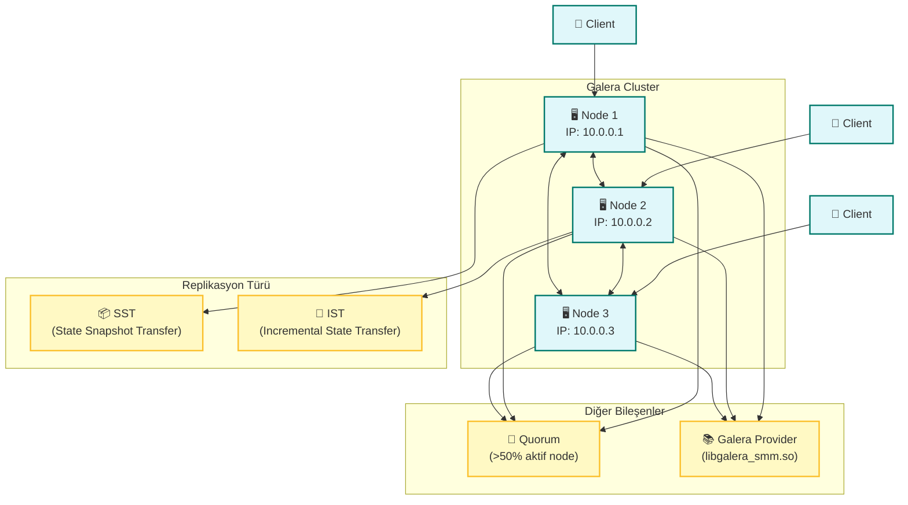

# Galera MariaDB Cluster (3 Node Setup)

Bu proje, **3 düğümlü (node)** bir Galera Cluster kurulumu gerçekleştirmek isteyen sistem yöneticileri ve geliştiriciler için hazırlanmıştır. MariaDB veritabanı, Galera ile senkronize çalışarak yüksek erişilebilirlik (HA) ve veri tutarlılığı sağlar.

## 🧩 Mimaride Kullanılan Bileşenler

- **Galera**: Synchronous Multi-Master Replication.
- **MariaDB 10.6.x**: MySQL uyumlu, gelişmiş açık kaynaklı veritabanı.
- **rsync**: SST (State Snapshot Transfer) için tercih edilen yöntem.
- **Ubuntu 22.04 LTS**: Tüm node’lar için önerilen işletim sistemi.

## 🌐 Cluster Yapılandırması

| Node  | IP Adresi   | Hostname |
|-------|-------------|----------|
| Node1 | 10.0.0.1    | node1    |
| Node2 | 10.0.0.2    | node2    |
| Node3 | 10.0.0.3    | node3    |

## 📊 Galera Cluster Mimarisi



## ⚙️ Örnek `my.cnf` Yapılandırması

(README içeriğinde tekrar yazılmadı, `node1/`, `node2/`, `node3/` klasörlerinde mevcut.)

## 🔧 Kurulum Adımları

1. **MariaDB ve Galera kurulumu:**
```bash
sudo apt update
sudo apt install mariadb-server galera-4 rsync
```

2. **Yapılandırma dosyasını düzenle.**

3. **Firewall Ayarları (Tüm Node'larda):**
```bash
sudo ufw allow 3306/tcp
sudo ufw allow 4567/tcp
sudo ufw allow 4568/tcp
sudo ufw allow 4444/tcp
```

4. **İlk Node'da Cluster başlat:**
```bash
sudo galera_new_cluster
```

5. **Diğer Node'ları başlat:**
```bash
sudo systemctl start mariadb
```

## 🩺 Kontrol Komutu

```bash
mysql -u root -p -e "SHOW STATUS LIKE 'wsrep_cluster_size';"
```

## 🛡️ Lisans

MIT License
